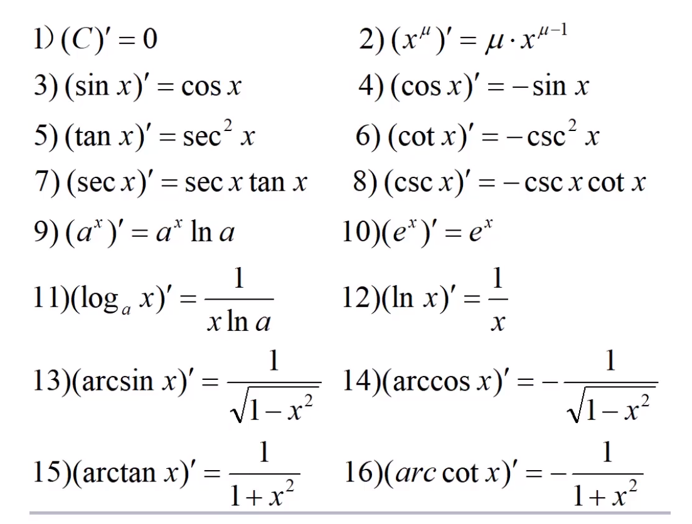
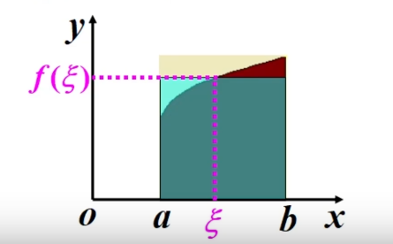
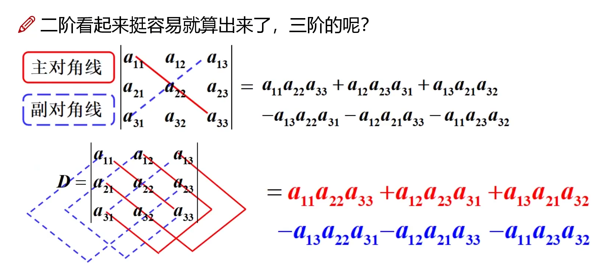
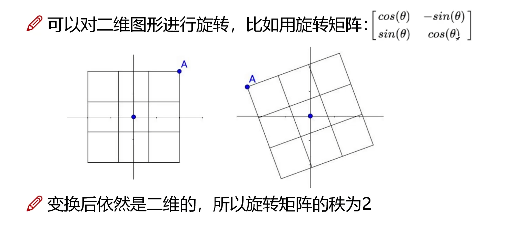
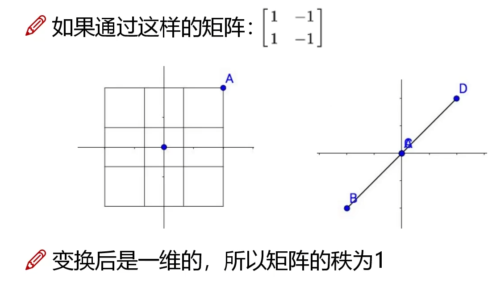

# 数学基础

参考课程：[(强推)人工智能必备数学基础全套课程_哔哩哔哩_bilibili](https://www.bilibili.com/video/BV1cy4y1u7XH?from=search&seid=6123025672646098861)

## 大纲

+ [x] 高等数学基础
+ [x] 微积分
+ [x] 泰勒公式与拉格朗日
+ [x] 线性代数基础
+ [ ] 特征值与矩阵分解
+ [ ] 随机变量
+ [ ] 概率论基础
+ [ ] 数据科学分布
+ [ ] 核函数变换
+ [ ] 熵与激活函数
+ [ ] 回归分析
+ [ ] 假设检验
+ [ ] 相关分析
+ [ ] 方差分析
+ [ ] 聚类分析
+ [ ] 贝叶斯分析

## 高等数学基础

### 极限

+ 表示当x从x0**右**侧无限接近于x0时。（右极限）
+ 表示当x从x0**左**侧无限接近于x0时。（左极限）
+ 既要考虑正无穷也要考虑**负无穷**。

### 无穷大与无穷小

+ **无穷小**与**负无穷大**是两个东西（一个趋近于零，一个趋近于负数的无穷大）
+ **高阶无穷小**的含义是，某个无穷小比另一个无穷小还小（相除之后求极限得到0）

### 连续性与导数

常用导数表：

### 方向导数

的方向导数为

其中是X轴与L向量的夹角。

> 这里的夹角是任意的，方向导数之所以叫方向导数是因为其需要指定**起点**和**指向的方向**。

多维函数同理可得。

### 梯度

梯度可以理解为方向导数的特例，也就是在以某个点为起点的时候，值最大的方向导数。

其实就是各个偏导的向量的和。

而所谓梯度下降就是沿着梯度的反方向走。

## 微积分

### 定积分

我们可以使用定义来计算定积分，而不需要去求所求积分函数的原函数。

我们可以将定积分写为，此时将区间进行n等分，每段区间的积分可以近似为区间长度乘上区间右侧的函数值。

易知，。

故有：

将函数值代入之后求极限即可。

### 定积分性质

+ 第一中值定理：设在区间上连续，则在区间内必定存在一点使得

  

  

## 泰勒公式与拉格朗日

### 泰勒公式

#### 一阶泰勒多项式

泰勒公式的**思路**在于使用一个已知的函数定值，以及函数值在区间上的近似变化值，进而近似的求出函数值。

我们可以很容易想到使用一阶导来模拟这个近似值，也就是。

故在只考虑一阶导的情况下的泰勒公式为：

#### 完整泰勒多项式

> 此处省略推导，课程上也只给了一个直观解释，但个人认为不严谨且难以令人信服，故不放在笔记里

当时，公式即为麦克劳林多项式（省略最后的误差项）

### 拉格朗日乘子法

该方法用于求解诸如【函数在的条件下的极值】的问题。

首先不考虑函数本身的极值，那么需要求的极值就仅可能是曲线上的值。

更严格的说，以该曲线上的极值点做切线，该切线同时也是函数的切线。

故考虑在该点上两个函数的切线向量平行。于是便可以列出如下方程：

其中为拉格朗日乘数，可以通过解上述方程得出。

> 理解不了没关系，大概理解一下然后记住就行。这里确实有点绕不过弯

## 线性代数基础

### 行列式

行列式计算如图所示：

### 秩

矩阵的秩定义为矩阵中所有行向量中**最大的线性无关组**。

#### 秩的理解

### 向量内积

两个向量的内积为**其对应位置数字的乘积的和**。（所以天然要求这两个向量长度相等）

当两个向量内积的值为零时，称这两个向量**正交**。两个向量正交则其线性无关。

## 特征值与矩阵分解

### 特征值/特征向量/特征空间

+ 对于矩阵A而言，存在向量x和常数使得，则称x为A的一个特征向量，对应的即为特征值。
  + 事实上就是求向量x使得Ax与x平行。
+ 特征空间：矩阵A的所有特征向量组成矩阵A的特征空间